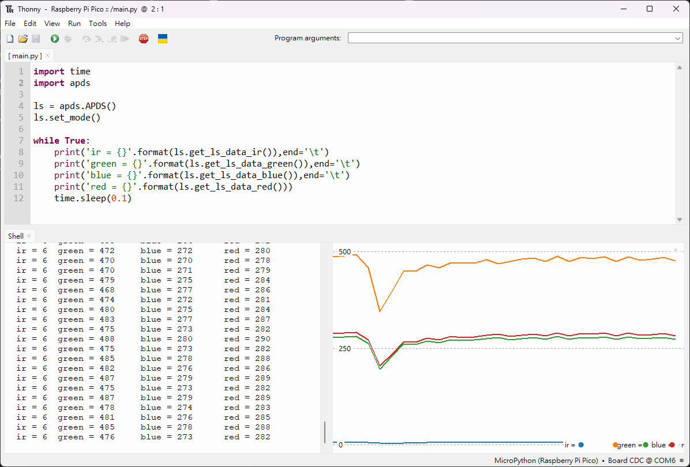

# RGB Light sensor APDS-9151 and reapberry pi pico
A digital proximity and RGB light sensor called ADPS-9151 is easily to use for detecting ambient light values which contain ir, green, blue and red light. This  sensor connects to raspberry pi pico via i2c interface which frequency up to 400khz.

## Installing
This project adopts MicroPython as the programming language, hence we have to setup the MicroPython on the raspberry pi pico. At raspberry pi's official webside [here](https://www.raspberrypi.com/documentation/microcontrollers/micropython.html), we can find the explain of setup in detail.

## Pin Connection
| raspberry pi pico w | | APDS-9151 |
| :--- | :---: |---: |
| GP16 | -> | SDA |
| GP17 | -> | SCL |
| 3V3 | -> | VCC |
| Gnd | -> | Gnd |

## Thonny
We use Thonny as development enviroment which can be downloaded at [here](https://thonny.org/)

## Code
Save the code as main.py and apds.py files into the raspberry pi pico.

## Result
Run the main.py, then you can sea the result shown as following image. You can use the Plotter (View->Plotter) show the values like right down curves 

## Reference
* Raspberry Pi Pico  
https://www.raspberrypi.com/products/raspberry-pi-pico/
* APDS-9151 data sheet 
https://www.broadcom.com/products/optical-sensors/integrated-ambient-light-and-proximity-sensors/apds-9151
* MicroPython i2c 
https://docs.micropython.org/en/latest/library/machine.I2C.html

## license
Licensed under creative commons attribution CC BY-NC-SA
