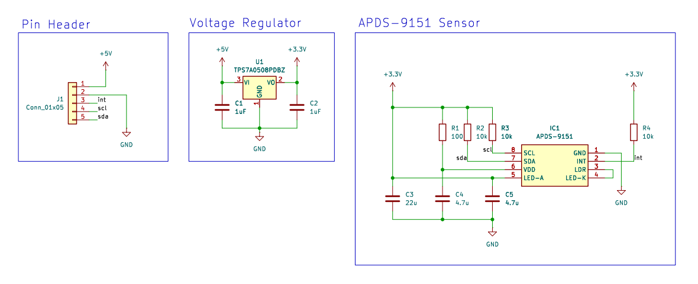
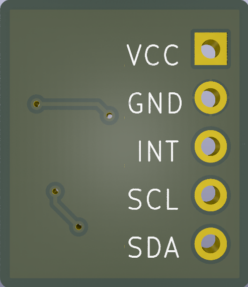

# RGB Light sensor APDS-9151 and reapberry pi pico
A digital proximity and RGB light sensor called ADPS-9151 is easily to use for detecting ambient light values which contain ir, green, blue and red light. This  sensor connects to raspberry pi pico via i2c interface which frequency up to 400khz.

## APDS-9151 Module
An APDS-9151 module for test the program is needed, so we desgin a simple PCB for installing the sensor. 
Considering that the sensor needs 1.7V to 3.6V supply voltage and the MCU development borad may not supports 3.3V output, a voltage regulator is required.
Its schematic is shown as follows. The complete schematic is available [__here__](./module/APDS9151_Module.pdf).
 
 

 
 
According the schematic, the module's layout is shown as follows. This PCB has a size of 15x14mm. You can find the Gerber files for this module in the zip file available [__here__](./module/gerber.zip).
 
 

## Pin Connection
| raspberry pi pico w | | APDS-9151 Module|
| :--- | :---: |---: |
| VBUS | -> | VCC |
| Gnd | -> | GND |
| GP16 | -> | SDA |
| GP17 | -> | SCL |
## Installing
This project adopts MicroPython as the programming language, hence we have to setup the MicroPython on the raspberry pi pico. At raspberry pi's official webside [__here__](https://www.raspberrypi.com/documentation/microcontrollers/micropython.html), we can find the explain of setup in detail.

## Thonny
We use Thonny as development enviroment which can be downloaded at [__here__](https://thonny.org/)

## Quick Start
Save the code as [__main.py__](./main.py) and [__apds.py__](./apds.py) files into the raspberry pi pico.

Than, run the main.py, then you can sea the result shown as following image. You can use the __Plotter__ (View->Plotter) show the values like right down curves

 

## Class APDS
### Constructor

    class apds.APDS( [i2c_addr = __APDS9151_ADDR],
                     [i2c_id = 0],
                     [scl_pin = 17],
                     [sda_pin = 16] )

Construct a new APDS object with the given arguments:
* __i2c_addr__ The i2c address of the apds9151 (optional)
* __i2c_id__ The i2c ID of the pi pico
* __scl_pin__ The pin of the scl
* __sda_pin__ The pin of the sda

### Method

    class apds.enable_light_sensor()
After power-on or software reset, the light sensor defaults to standby mode. To use the light sensor, it should be set to active mode using this method.

 

    class apds.set_ambient_light_mode

The APDS9151 defaults to ambient light mode. When users change the light detection mode, the method to revert to the default mode should not require a software reset. In ambient light mode, only the output values from the ALS(Green) channel and IR channel are available. The output values of the other channels are all 0.

 

    class apds.set_rgb_mode()

 If users require to Red, Green and Blue light brightness values, the sensor mode has to be set to RGB mode.

 

    class apds.get_als_value()

Aquire the als valse.

 

    class apds.get_rgb_value()

Aquire the brightness values of red, green, and blue in the form of (R, G, B).

 

    class apds.get_ir_value()

Aquire the ir value.

## Reference
* Raspberry Pi Pico  
https://www.raspberrypi.com/products/raspberry-pi-pico/
* APDS-9151 data sheet 
https://www.broadcom.com/products/optical-sensors/integrated-ambient-light-and-proximity-sensors/apds-9151
* MicroPython i2c 
https://docs.micropython.org/en/latest/library/machine.I2C.html

## license
Licensed under creative commons attribution CC BY-NC-SA
